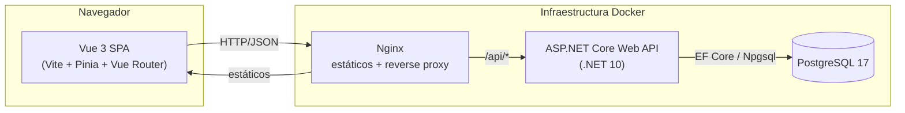
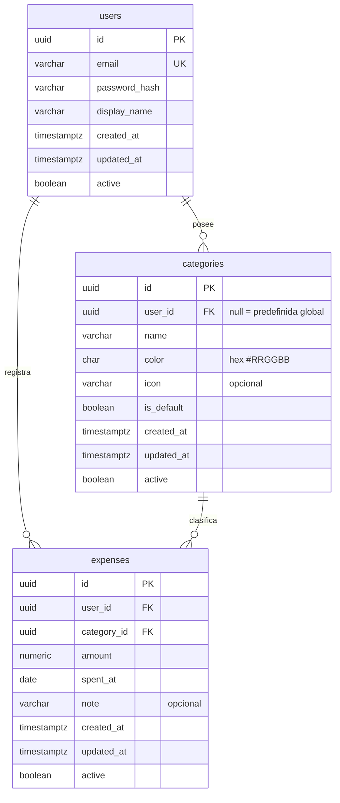
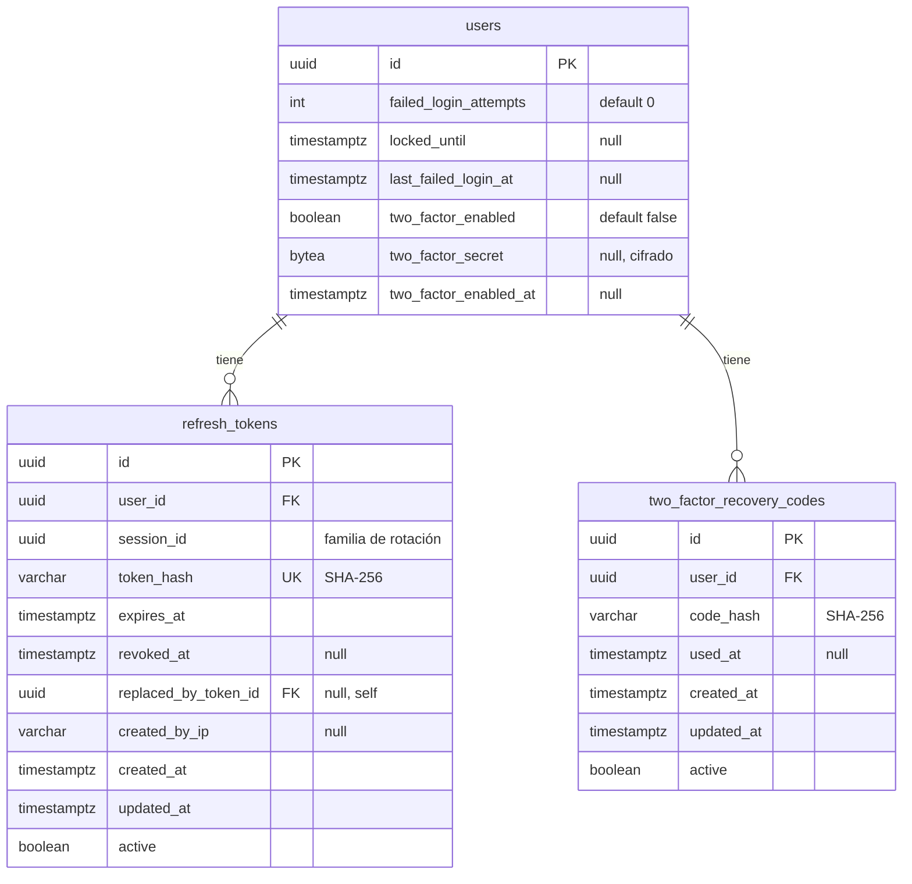

# Arquitectura — gestor-gastos

Gestor de gastos personales. Aplicación fullstack con API REST en ASP.NET Core,
base de datos PostgreSQL y cliente SPA en Vue 3. Este documento es el contrato
técnico del proyecto: define estructura, modelo de datos y API para que backend
y frontend se desarrollen en paralelo sin ambigüedad.

## 1. Visión general y decisiones clave

La aplicación permite a un usuario registrarse, iniciar sesión y llevar el
control de sus gastos personales clasificados por categoría, con un panel de
resumen (totales por mes y por categoría) y filtros por rango de fechas y
categoría.

Arquitectura de alto nivel: **cliente SPA + API REST + base de datos
relacional**, todo orquestado con Docker Compose.

- **Monorepo** con dos aplicaciones desacopladas (`backend/` y `frontend/`) que
  se comunican exclusivamente por HTTP/JSON. El desacople permite desplegar y
  escalar cada parte por separado y desarrollarlas en paralelo.
- **Backend por capas ligeras** (Api → Domain + Infrastructure). Separación
  suficiente para que sea testeable y legible, sin la sobrecarga de una Clean
  Architecture completa que no aporta valor a un MVP.
- **Autenticación stateless con JWT** (Bearer). La API no guarda sesión de
  acceso; el token porta la identidad. Encaja con un cliente SPA y simplifica el
  despliegue. En v2 se añade una tabla de *refresh tokens* para renovar el
  acceso sin volver a introducir credenciales (ver sección 12).
- **Borrado lógico** (`active`) en todas las tablas: nada se elimina físicamente;
  se marca inactivo. Un filtro global de EF Core lo aplica de forma transparente.
- **PostgreSQL** como único almacén, con esquema en snake_case en inglés y
  claves primarias `uuid` (no enumerables desde fuera).
- **Respuestas de error normalizadas** con `ProblemDetails` (RFC 7807), el
  estándar nativo de ASP.NET Core.

Decisiones grandes con alternativas se detallan en las secciones 9 y 12.

## 2. Estrategia de renderizado y distribución

- **SPA (Single Page Application)** servida como estáticos. Vite compila el
  cliente Vue a HTML/JS/CSS estáticos; el enrutado ocurre en el navegador con
  Vue Router. No hay SSR ni SSG: el contenido es privado por usuario (tras
  login) y no requiere SEO ni first-paint de datos públicos, por lo que el coste
  de SSR no se justifica.
- **No es PWA.** No se busca instalación ni funcionamiento offline: la app
  depende de la API para todos los datos. Se descarta service worker y manifest
  para no añadir complejidad sin beneficio en el alcance actual.
- **Distribución:** en desarrollo, Vite sirve el cliente con hot reload y hace
  proxy de `/api` al backend. En producción, el build estático se sirve tras un
  servidor web (Nginx en el contenedor del frontend) que además hace de reverse
  proxy hacia la API. Backend y base de datos corren en sus propios contenedores.

## 3. Diagrama del sistema



Flujo: el navegador carga la SPA desde Nginx; toda petición de datos va a
`/api/*`, que Nginx reenvía a la API; la API consulta PostgreSQL mediante EF
Core. El JWT viaja en la cabecera `Authorization: Bearer <token>` en cada
petición autenticada.

## 4. Estructura de carpetas

```text
gestor-gastos/
├─ ARCHITECTURE.md              # este documento
├─ DESIGN.md                    # guía visual (fase de diseño)
├─ README.md                    # puesta en marcha y despliegue
├─ docker-compose.yml           # orquestación: db + api + web
├─ .env.example                 # plantilla de variables de entorno
├─ .gitignore
│
├─ backend/
│  ├─ GestorGastos.sln
│  ├─ Dockerfile                # build multi-stage de la API
│  ├─ .dockerignore
│  ├─ src/
│  │  ├─ GestorGastos.Api/            # capa de presentación (Web API)
│  │  │  ├─ Program.cs                # arranque, DI, middleware, auth
│  │  │  ├─ appsettings.json
│  │  │  ├─ Controllers/              # AuthController, ExpensesController, ...
│  │  │  ├─ Dtos/                     # request/response DTOs (contrato JSON)
│  │  │  ├─ Validators/               # validación FluentValidation
│  │  │  ├─ Mapping/                  # entidad <-> DTO
│  │  │  └─ Middleware/               # manejo global de errores
│  │  │
│  │  ├─ GestorGastos.Domain/         # entidades y reglas de dominio
│  │  │  ├─ Entities/                 # User, Category, Expense, RefreshToken, ...
│  │  │  └─ Common/                   # tipos base (p. ej. AuditableEntity)
│  │  │
│  │  └─ GestorGastos.Infrastructure/ # acceso a datos y servicios técnicos
│  │     ├─ Persistence/
│  │     │  ├─ AppDbContext.cs
│  │     │  ├─ Configurations/        # IEntityTypeConfiguration por entidad
│  │     │  ├─ Seed/                  # categorías predefinidas
│  │     │  └─ Migrations/            # migraciones EF Core versionadas
│  │     ├─ Auth/                     # JWT, hashing, refresh tokens, TOTP, cifrado
│  │     └─ DependencyInjection.cs    # registro de servicios de infraestructura
│  │
│  └─ tests/
│     └─ GestorGastos.Tests/          # xUnit (unit + integración)
│
└─ frontend/
   ├─ Dockerfile                # build Vite + Nginx
   ├─ nginx.conf                # estáticos + proxy /api
   ├─ index.html
   ├─ package.json
   ├─ vite.config.ts
   ├─ tsconfig.json
   ├─ tailwind.config.ts
   ├─ .env.example
   └─ src/
      ├─ main.ts
      ├─ App.vue
      ├─ router/                # definición de rutas y guards de auth
      ├─ stores/                # Pinia: auth, expenses, categories
      ├─ services/              # cliente HTTP (axios) y llamadas a la API
      ├─ types/                 # interfaces TS del contrato (DTOs)
      ├─ views/                 # páginas: Login, Register, Dashboard, Expenses
      ├─ components/            # componentes reutilizables (incl. gráficos)
      └─ assets/
```

**Ubicación de las migraciones EF Core:**
`backend/src/GestorGastos.Infrastructure/Persistence/Migrations/`. Se generan
apuntando al proyecto de infraestructura como *startup* de diseño y quedan
versionadas en el repo. `AppDbContext` vive en Infrastructure; la API lo
consume por inyección de dependencias.

## 5. Versiones exactas

### Backend

| Componente | Versión |
|---|---|
| .NET SDK / runtime | 10.0.x (LTS, SDK 10.0.102) |
| ASP.NET Core | 10.0.x |
| Microsoft.EntityFrameworkCore | 10.0.x |
| Npgsql.EntityFrameworkCore.PostgreSQL | 10.0.x |
| EFCore.NamingConventions | 10.0.x |
| Microsoft.AspNetCore.Authentication.JwtBearer | 10.0.x |
| Rate limiting (`Microsoft.AspNetCore.RateLimiting`) | incorporado en el shared framework de ASP.NET Core 10 (sin NuGet aparte) |
| Otp.NET (TOTP RFC 6238) | 1.4.0 |
| Swashbuckle.AspNetCore (Swagger/OpenAPI + UI) | 9.0.x |
| FluentValidation | 12.0.x |
| BCrypt.Net-Next (hash de contraseñas) | 4.0.3 |
| xUnit | 2.9.x |
| Microsoft.NET.Test.Sdk | 17.x |
| Microsoft.AspNetCore.Mvc.Testing (integración) | 10.0.x |

Configuración transversal del backend: **nullable habilitado**, warnings como
convención, y snake_case aplicado por `EFCore.NamingConventions`
(`UseSnakeCaseNamingConvention`).

### Frontend

| Componente | Versión |
|---|---|
| Node.js | 24.13.x |
| Vue | 3.5.x |
| TypeScript | 5.9.x (modo estricto) |
| Vite | 7.x |
| Pinia | 3.x |
| Vue Router | 4.5.x |
| Tailwind CSS | 4.x (plugin `@tailwindcss/vite`) |
| Axios | 1.x |
| Chart.js + vue-chartjs (gráficos del dashboard) | 4.x / 5.x |
| qrcode (render del QR de 2FA en cliente) | 1.5.x |
| Vitest | 3.x |
| @testing-library/vue | 8.x |
| eslint-plugin-vue | 10.x |

`vue/block-order` de `eslint-plugin-vue` configurado para forzar el orden de
bloques SFC: `<template>` → `<script setup>` → `<style>`.

> Nota: las versiones `.x` fijan la línea *major.minor* verificada como
> compatible; el `lock`/csproj clavará el patch exacto en la implementación.

## 6. Modelo de datos (PostgreSQL)

Entidades del MVP: `users`, `categories`, `expenses`. La fase de seguridad v2
añade `refresh_tokens`, `two_factor_recovery_codes` y columnas nuevas en
`users` (ver sección 12.5). Todas las tablas usan PK `uuid`
(`gen_random_uuid()`) y llevan los campos de auditoría obligatorios:
`created_at`, `updated_at` (ambos `timestamptz`) y `active` (`boolean`, borrado
lógico). El código C# expone estos campos como `CreatedAt`, `UpdatedAt`,
`Active`; el mapeo a snake_case lo hace EF Core automáticamente.

### Diagrama entidad-relación



### Tabla `users`

| Columna | Tipo | Restricciones |
|---|---|---|
| id | uuid | PK, default `gen_random_uuid()` |
| email | varchar(320) | NOT NULL, único (índice único sobre `lower(email)`) |
| password_hash | varchar(200) | NOT NULL (BCrypt) |
| display_name | varchar(100) | NOT NULL |
| created_at | timestamptz | NOT NULL, default `now()` |
| updated_at | timestamptz | NOT NULL, default `now()` |
| active | boolean | NOT NULL, default `true` |

> En v2 esta tabla suma columnas de bloqueo por intentos fallidos y de 2FA; ver
> sección 12.5.

### Tabla `categories`

| Columna | Tipo | Restricciones |
|---|---|---|
| id | uuid | PK, default `gen_random_uuid()` |
| user_id | uuid | FK → `users(id)`, **NULL permitido** |
| name | varchar(60) | NOT NULL |
| color | char(7) | NOT NULL, hex `#RRGGBB` (para los gráficos) |
| icon | varchar(40) | NULL (nombre de icono opcional) |
| is_default | boolean | NOT NULL, default `false` |
| created_at | timestamptz | NOT NULL, default `now()` |
| updated_at | timestamptz | NOT NULL, default `now()` |
| active | boolean | NOT NULL, default `true` |

Modelado de **predefinidas vs personalizadas**:

- **Predefinidas (globales):** `user_id = NULL` e `is_default = true`. Se cargan
  por *seed* en la migración inicial y son visibles para todos los usuarios.
  Nadie las puede editar ni borrar (no tienen dueño).
- **Personalizadas:** `user_id = <usuario>` e `is_default = false`. Solo su
  dueño las ve, edita o borra.

Índices y restricciones:

- Índice único parcial sobre `(user_id, lower(name))` donde `active = true`:
  evita nombres duplicados dentro de las categorías propias de un usuario.
- Índice único parcial sobre `lower(name)` donde `user_id IS NULL AND active =
  true`: evita globales duplicadas.
- FK `user_id` con `ON DELETE RESTRICT` (se usa borrado lógico, no cascada).

### Tabla `expenses`

| Columna | Tipo | Restricciones |
|---|---|---|
| id | uuid | PK, default `gen_random_uuid()` |
| user_id | uuid | FK → `users(id)`, NOT NULL |
| category_id | uuid | FK → `categories(id)`, NOT NULL |
| amount | numeric(12,2) | NOT NULL, CHECK `amount > 0` |
| spent_at | date | NOT NULL (fecha del gasto) |
| note | varchar(500) | NULL |
| created_at | timestamptz | NOT NULL, default `now()` |
| updated_at | timestamptz | NOT NULL, default `now()` |
| active | boolean | NOT NULL, default `true` |

Índices:

- `(user_id, spent_at)`: filtro por rango de fechas y agregación mensual.
- `(user_id, category_id)`: filtro por categoría y agregación por categoría.

Relaciones:

- `users` 1—* `expenses` (todo gasto pertenece a un usuario).
- `users` 1—* `categories` (categorías propias; las globales tienen `user_id`
  nulo).
- `categories` 1—* `expenses` (un gasto siempre referencia una categoría).

## 7. Contrato de API REST

- **Prefijo base:** `/api`. Todas las rutas cuelgan de ahí.
- **Formato:** JSON con claves **camelCase** (los DTOs C# se serializan con la
  política camelCase de `System.Text.Json`).
- **Fechas:** `spentAt` es fecha sin hora `YYYY-MM-DD`; los timestamps de
  auditoría son ISO 8601 UTC (`2026-07-17T12:34:56Z`).
- **Dinero:** `amount` es número decimal con 2 decimales.
- **Autenticación:** salvo los endpoints públicos de `auth` (registro, login,
  refresh, verificación de 2FA), todos los endpoints requieren
  `Authorization: Bearer <token>`. Sin token o token inválido → `401`.
- **Aislamiento por usuario:** un usuario solo ve y modifica sus propios
  recursos. Acceder a un recurso de otro usuario → `404` (no se revela
  existencia).
- **Documentación viva:** Swagger UI expuesto en `/swagger` en desarrollo.

### 7.1 Formato de error (ProblemDetails)

Todas las respuestas de error usan RFC 7807:

```json
{
  "type": "https://httpstatuses.io/400",
  "title": "Validation failed",
  "status": 400,
  "detail": "One or more fields are invalid.",
  "errors": {
    "amount": ["El monto debe ser mayor que 0."],
    "categoryId": ["La categoría no existe."]
  }
}
```

El campo `errors` (diccionario campo → lista de mensajes) solo aparece en
errores de validación (`400`/`422`). Los mensajes destinados al usuario van en
español.

Códigos de estado usados en toda la API:

| Código | Uso |
|---|---|
| 200 OK | Lectura o actualización correcta |
| 201 Created | Recurso creado (incluye `Location`) |
| 204 No Content | Borrado correcto |
| 400 Bad Request | Cuerpo malformado o validación fallida |
| 401 Unauthorized | Falta token o es inválido/expirado; credenciales incorrectas |
| 403 Forbidden | Autenticado pero sin permiso sobre el recurso |
| 404 Not Found | Recurso inexistente o de otro usuario |
| 409 Conflict | Conflicto de estado (email en uso, categoría en uso, nombre duplicado) |
| 422 Unprocessable Entity | Reservado para reglas de negocio complejas |
| 429 Too Many Requests | Límite de rate limiting superado (ver sección 12.2) |

### 7.2 Autenticación

> **Nota v2:** desde la fase de seguridad, las respuestas de `register`, `login`
> y `refresh` incluyen además un `refreshToken` con su `refreshTokenExpiresAt`, y
> `user` incorpora `twoFactorEnabled`. Si el usuario tiene 2FA activo, `login`
> responde un **desafío** en vez de los tokens. El detalle completo (formas
> exactas, rotación, 2FA) está en la sección 12; aquí se documenta el flujo base
> retrocompatible.

#### POST /api/auth/register

Crea un usuario y devuelve un token listo para usar.

Request:
```json
{ "email": "ana@mail.com", "password": "secret123", "displayName": "Ana" }
```
- `email`: requerido, formato email, ≤320 chars, único.
- `password`: requerido, 8–100 chars.
- `displayName`: requerido, 1–100 chars.

Response `201`:
```json
{
  "token": "eyJhbGciOi...",
  "expiresAt": "2026-07-17T13:34:56Z",
  "refreshToken": "b64url-opaco...",
  "refreshTokenExpiresAt": "2026-07-31T12:34:56Z",
  "user": { "id": "uuid", "email": "ana@mail.com", "displayName": "Ana", "twoFactorEnabled": false }
}
```
Errores: `400` validación, `409` email ya registrado, `429` rate limit.

#### POST /api/auth/login

Request:
```json
{ "email": "ana@mail.com", "password": "secret123" }
```
Response `200`:
- **Sin 2FA:** idéntico al de registro (`token`, `expiresAt`, `refreshToken`,
  `refreshTokenExpiresAt`, `user`).
- **Con 2FA activo:** desafío de segundo factor (ver sección 12.4):
  ```json
  { "twoFactorRequired": true, "twoFactorToken": "eyJhbGciOi..." }
  ```
Errores: `400` validación, `401` credenciales inválidas (mismo mensaje genérico
para email o contraseña incorrectos, sin distinguir cuál, y también cuando la
cuenta está temporalmente bloqueada — ver sección 12.3), `429` rate limit.

#### GET /api/auth/me

Devuelve el usuario del token. Requiere auth.
Response `200`: `{ "id", "email", "displayName", "twoFactorEnabled" }`. Error: `401`.

### 7.3 Categorías

DTO de categoría (respuesta):
```json
{ "id": "uuid", "name": "Comida", "color": "#F97316", "icon": "utensils", "isDefault": true }
```

| Método | Ruta | Descripción |
|---|---|---|
| GET | /api/categories | Lista globales + propias del usuario |
| POST | /api/categories | Crea una categoría personalizada |
| PUT | /api/categories/{id} | Edita una categoría propia |
| DELETE | /api/categories/{id} | Borra (lógico) una categoría propia |

- **GET /api/categories** → `200` con `[]` de categorías (globales primero,
  luego propias, ambas ordenadas por nombre).
- **POST** request: `{ "name", "color", "icon"? }`
  - `name`: requerido, 1–60 chars, único entre las del usuario.
  - `color`: requerido, hex `#RRGGBB`.
  - `icon`: opcional, ≤40 chars.
  - → `201` con la categoría creada (`isDefault: false`). `409` si el nombre ya
    existe entre las propias.
- **PUT** request: igual que POST. Solo categorías propias.
  - → `200` con la categoría actualizada. `404` si no existe o es de otro
    usuario. `403`/`404` si se intenta editar una global (no tiene dueño → se
    trata como no encontrada para el usuario). `409` nombre duplicado.
- **DELETE** → `204`. Reglas:
  - Solo categorías propias (`404` en caso contrario).
  - Si la categoría tiene gastos activos asociados → `409 Conflict` (para
    borrarla, el usuario debe reasignar o eliminar esos gastos antes). Evita
    dejar gastos "huérfanos" en el panel.

### 7.4 Gastos

DTO de gasto (respuesta):
```json
{
  "id": "uuid",
  "amount": 42.50,
  "spentAt": "2026-07-15",
  "note": "Almuerzo",
  "category": { "id": "uuid", "name": "Comida", "color": "#F97316" }
}
```

| Método | Ruta | Descripción |
|---|---|---|
| GET | /api/expenses | Lista paginada con filtros |
| GET | /api/expenses/{id} | Un gasto |
| POST | /api/expenses | Crea un gasto |
| PUT | /api/expenses/{id} | Edita un gasto |
| DELETE | /api/expenses/{id} | Borra (lógico) un gasto |

**GET /api/expenses** — parámetros de consulta (todos opcionales):

| Parámetro | Tipo | Descripción |
|---|---|---|
| from | date `YYYY-MM-DD` | Límite inferior de `spentAt` (inclusive) |
| to | date `YYYY-MM-DD` | Límite superior de `spentAt` (inclusive) |
| categoryId | uuid | Filtra por categoría |
| page | int | Página, base 1 (default 1) |
| pageSize | int | Tamaño, default 20, máx 100 |
| sort | string | `spentAt` \| `amount`, con prefijo `-` para desc (default `-spentAt`) |

Response `200` (envoltura de paginación):
```json
{
  "items": [ /* ExpenseDto[] */ ],
  "page": 1,
  "pageSize": 20,
  "totalItems": 137,
  "totalPages": 7
}
```

**POST /api/expenses** request:
```json
{ "amount": 42.50, "spentAt": "2026-07-15", "note": "Almuerzo", "categoryId": "uuid" }
```
- `amount`: requerido, > 0, máx 2 decimales.
- `spentAt`: requerido, fecha válida (no futura respecto a hoy → validación de
  negocio; ver nota abierta).
- `note`: opcional, ≤500 chars.
- `categoryId`: requerido, debe existir y ser global o propia del usuario.
- → `201` con el `ExpenseDto` y cabecera `Location`. `400` validación, `404` si
  la categoría no existe o no es accesible.

**PUT /api/expenses/{id}** request: igual que POST. → `200` con el gasto
actualizado. `404` si no existe o es de otro usuario.

**DELETE /api/expenses/{id}** → `204`. `404` si no existe o es de otro usuario.

### 7.5 Dashboard

#### GET /api/dashboard/summary

Devuelve los agregados para los gráficos del panel, respetando los mismos
filtros de fecha que la lista de gastos.

Parámetros: `from`, `to` (opcionales, `YYYY-MM-DD`). Sin parámetros, considera
todo el histórico del usuario.

Response `200`:
```json
{
  "total": 1234.50,
  "byCategory": [
    { "categoryId": "uuid", "categoryName": "Comida", "color": "#F97316", "total": 540.00 },
    { "categoryId": "uuid", "categoryName": "Transporte", "color": "#3B82F6", "total": 320.50 }
  ],
  "byMonth": [
    { "month": "2026-06", "total": 610.00 },
    { "month": "2026-07", "total": 624.50 }
  ]
}
```

- `total`: suma de todos los gastos activos en el rango.
- `byCategory`: un elemento por categoría con gasto en el rango, ordenado por
  `total` descendente. Alimenta el gráfico de tarta/dona.
- `byMonth`: un elemento por mes (`YYYY-MM`) con gasto, orden cronológico
  ascendente. Alimenta el gráfico de barras/línea.

Todos los cálculos se restringen a los gastos del usuario autenticado y a filas
`active = true`.

## 8. Autenticación y autorización

- **Esquema:** JWT Bearer stateless, firma **HS256** con clave simétrica
  (`Jwt:Secret` desde configuración/entorno; nunca en el repo).
- **Qué protege:** todos los endpoints excepto los públicos de `auth` (registro,
  login, refresh, verificación de 2FA). La política por defecto exige usuario
  autenticado (`RequireAuthenticatedUser`); los controladores llevan
  `[Authorize]` y los endpoints públicos `[AllowAnonymous]`.
- **Claims del token de acceso:**

  | Claim | Contenido |
  |---|---|
  | `sub` | id del usuario (uuid) |
  | `email` | email del usuario |
  | `jti` | id único del token |
  | `iat` | emitido en |
  | `exp` | expiración |
  | `iss` / `aud` | emisor y audiencia (validados) |

- **Expiración del access token:** **15 minutos** para tokens nuevos (reducido
  desde los 60 min del MVP). El cambio solo afecta a tokens emitidos a partir de
  ahora; los access tokens de 60 min ya emitidos siguen siendo válidos hasta su
  propia expiración (el JWT es autocontenido y la validación solo comprueba firma
  y `exp`). La renovación se hace con **refresh tokens con rotación** (sección
  12.1); ya no se fuerza re-login al expirar el acceso.
- **Hash de contraseñas:** BCrypt (`BCrypt.Net-Next`) con work factor por
  defecto. Nunca se almacena ni se registra la contraseña en claro.
- **Autorización a nivel de recurso:** toda consulta filtra por el `sub` del
  token. Un recurso que no pertenece al usuario responde `404`, no `403`, para
  no revelar su existencia.
- **Almacenamiento del token en el cliente:** el SPA guarda el JWT de acceso y el
  refresh token en `localStorage` y adjunta el acceso vía interceptor de Axios.
  Es lo simple y estándar para una SPA; se asume el riesgo XSS asociado y se
  mitiga con la política de escape de Vue, la validación de entradas y la
  **rotación con detección de reuso** de los refresh tokens (sección 12.1).
  Alternativa (cookie `HttpOnly`) discutida en la sección 12.1.
- **CORS:** en desarrollo se permite el origen del dev server de Vite. En
  producción, al servir SPA y API tras el mismo host (Nginx / rewrite de la
  plataforma), las peticiones son *same-origin* y no requieren CORS.

## 9. Decisiones de arquitectura y alternativas descartadas

**Estructura del backend — capas ligeras (elegida) vs proyecto único vs Clean
Architecture completa.**
Se eligen tres proyectos (Api, Domain, Infrastructure) + tests: separa dominio y
acceso a datos de la presentación, es testeable y reconocible, sin la ceremonia
de una capa de aplicación con CQRS/MediatR que no aporta a un CRUD de este
tamaño. *Descartado:* proyecto único (mezcla responsabilidades, peor como
muestra de portafolio) y Clean Architecture de 4+ capas con mediador
(sobre-ingeniería para el alcance).

**Claves primarias `uuid` (elegida) vs `bigint` autoincremental.**
`uuid` evita ids enumerables en URLs y tokens, y simplifica futuras
integraciones. *Descartado:* `bigint` por su ligera ventaja de tamaño de índice,
irrelevante a esta escala.

**JWT sin refresh token (elegida en el MVP) vs con refresh token.**
Un único access token de 60 min mantuvo la API stateless y sin tabla de
sesiones/tokens durante el MVP. **Actualizado en v2:** se incorporan refresh
tokens con rotación y detección de reuso, access token corto (15 min) y una
tabla de sesiones; el detalle está en la sección 12.1.

**Categorías predefinidas como filas globales `user_id NULL` (elegida) vs
copiarlas a cada usuario al registrarse.**
Una sola fuente de verdad para las globales, sin duplicar datos ni lógica de
copia. *Descartado:* clonar las predefinidas por usuario (más filas, riesgo de
divergencia) y una tabla/enum aparte (complica el join uniforme con `expenses`).

**Borrado de categoría con gastos: bloquear con `409` (elegida) vs cascada /
reasignar a "Sin categoría".**
Bloquear es predecible y deja la decisión al usuario. *Descartado:* borrado en
cascada de gastos (destruye datos) y reasignación automática (requiere una
categoría comodín y oculta el efecto).

**Errores con `ProblemDetails` (elegida) vs envoltura propia.**
Es el estándar RFC 7807 nativo de ASP.NET Core, entendido por herramientas y
clientes. *Descartado:* un sobre `{ success, data, error }` propio, redundante
con los códigos HTTP.

**Token en `localStorage` (elegida) vs cookie `HttpOnly`.**
`localStorage` es directo para un SPA con API Bearer y despliegue simple.
*Descartado (documentado):* cookie `HttpOnly` + protección CSRF, más segura
frente a XSS pero con más complejidad. El análisis actualizado para el refresh
token, incluida esta alternativa, está en la sección 12.1.

## 10. Convenciones transversales

- **Mapeo de nombres:** BD en snake_case (`spent_at`) ← EF Core
  `UseSnakeCaseNamingConvention` → entidades C# en PascalCase (`SpentAt`) →
  JSON en camelCase (`spentAt`) por la política de `System.Text.Json`. Cada capa
  usa su convención idiomática; no se fuerza snake_case fuera de la BD.
- **Validación:** FluentValidation en la capa Api, un validador por request DTO;
  los fallos se traducen a `ProblemDetails` con el diccionario `errors`.
- **Manejo de errores:** middleware global que captura excepciones no
  controladas y responde `ProblemDetails` (500 genérico sin filtrar detalles en
  producción). Las excepciones de dominio conocidas mapean a su código HTTP.
- **Consultas de solo lectura:** `AsNoTracking` y proyección directa a DTO.
- **Borrado lógico:** filtro global de consulta de EF Core sobre `active = true`;
  las operaciones de borrado marcan `active = false` y actualizan `updated_at`.
- **Auditoría:** `created_at`/`updated_at` los gestiona el `DbContext` en
  `SaveChanges` (no se confían al cliente).
- **Paginación:** solo la lista de gastos; envoltura `{ items, page, pageSize,
  totalItems, totalPages }`, `pageSize` con tope de 100.
- **Zona horaria:** timestamps en UTC (`timestamptz`); la conversión a hora
  local es responsabilidad del cliente. `spent_at` es fecha pura sin zona.

## 11. Notas abiertas (a confirmar con el usuario)

- **Gastos con fecha futura:** el contrato asume que `spentAt` no puede ser
  posterior a hoy (un gasto ya ocurrió). Si se quisieran registrar gastos
  planificados, habría que relajar esa validación.
- **Moneda única:** el MVP asume una sola moneda implícita (sin campo
  `currency`). Multi-moneda quedaría fuera de alcance.

## 12. Seguridad de nivel producción (v2)

Esta sección endurece la autenticación existente sin romper sesiones ni datos.
Principios que gobiernan todo el diseño:

- **Migraciones aditivas.** Solo se añaden columnas nullable o con `default`, y
  tablas nuevas. Ninguna operación reescribe ni invalida filas existentes.
- **Retrocompatibilidad del contrato.** `AuthResponse` conserva `token`,
  `expiresAt` y `user`; los campos nuevos (`refreshToken`,
  `refreshTokenExpiresAt`, `user.twoFactorEnabled`) se **agregan**. Un cliente
  antiguo que ignore los campos nuevos sigue funcionando mientras el usuario no
  active 2FA.
- **Sesiones vigentes intactas.** Reducir el lifetime del access token a 15 min
  solo aplica a tokens nuevos; los de 60 min ya emitidos siguen válidos hasta su
  `exp`. Las sesiones actuales sin refresh token, al expirar el acceso, harán un
  re-login normal; a partir de ahí obtienen refresh token.

### 12.1 Refresh tokens con rotación

**Modelo.** El access token sigue siendo un JWT HS256 stateless (15 min). El
refresh token es un valor **opaco** de alta entropía (32 bytes aleatorios,
`RandomNumberGenerator`, codificado en base64url), **no** un JWT. Se entrega al
cliente en claro una única vez y en la base de datos se guarda **solo su hash**
(SHA-256, base64), nunca el valor en claro. Lifetime del refresh token: **14
días** (deslizante por rotación).

Justificación de lifetimes: access 15 min limita la ventana de uso de un token
robado sin obligar a renovar en cada request; refresh 14 días evita re-logins
frecuentes en uso normal y, al rotar en cada uso, su ventana efectiva de riesgo
es pequeña (un refresh robado deja de servir en cuanto el legítimo rota). No se
fija un tope absoluto de sesión en esta fase (se prioriza simplicidad); podría
añadirse más adelante un `absolute_expires_at` por familia.

**Rotación y familias de sesión.** Cada refresh token pertenece a una *familia*
(`session_id`) que representa una sesión/dispositivo. En cada refresh:

1. Se hashea el token recibido y se busca por `token_hash`.
2. Si no existe → `401` (token inválido).
3. Si existe pero está revocado, inactivo o expirado → ver **detección de reuso**.
4. Si es válido → se **rota**: el token actual se marca revocado
   (`revoked_at = now`), se crea uno nuevo con el mismo `session_id`,
   `replaced_by_token_id` apunta al nuevo, y se emite un access token fresco. Se
   devuelven ambos tokens nuevos.

**Detección de reuso.** Un refresh token ya revocado que se vuelve a presentar
indica robo (el atacante o el cliente legítimo usó un token viejo). Ante ese
caso se **revoca toda la familia** (`session_id`): se marcan revocados todos los
refresh tokens activos de esa sesión. La respuesta es `401` y el usuario deberá
volver a iniciar sesión en ese dispositivo. Así, aunque un atacante logre robar
un refresh token, en cuanto el legítimo (o el atacante) rote, el primer reuso
mata la cadena.

**Logout.** Revoca el refresh token presentado y, por consistencia, toda su
familia (`session_id`). El access token no se puede revocar (es stateless) pero
caduca en ≤15 min. El cliente borra ambos tokens de `localStorage`.

**Transporte del refresh token — decisión.** Se entrega en el **cuerpo de la
respuesta** (campo `refreshToken`) y el SPA lo guarda en `localStorage`
(`gestor-gastos.refreshToken`), junto al access token. Motivos:

- No rompe el flujo actual basado en `localStorage`, requisito de esta fase.
- El endpoint `/api/auth/refresh` recibe el refresh token en el cuerpo; al ser
  una llamada explícita, no hay riesgo CSRF (no viaja como cookie automática) y
  no se necesita token anti-CSRF.
- En producción el SPA llama a `/api` *same-origin* vía rewrite de la
  plataforma hacia un backend en otro host; una cookie `HttpOnly` con
  `Domain`/`Path` correctos a través de ese rewrite es frágil y dependiente del
  proveedor.

*Alternativa evaluada y descartada (documentada):* refresh token en **cookie
`HttpOnly` + Secure + SameSite=Strict**. Es más resistente a XSS (JavaScript no
puede leer la cookie), pero exige token anti-CSRF para el refresh, un manejo de
`Set-Cookie` fiable a través del rewrite de la plataforma, y rompería el flujo
`localStorage` actual. Para un proyecto de portafolio, la rotación con detección
de reuso mitiga el riesgo residual de forma suficiente; la cookie `HttpOnly`
queda como endurecimiento futuro si se unifica el dominio.

**Formas exactas.**

`POST /api/auth/refresh` — request:
```json
{ "refreshToken": "b64url-opaco..." }
```
Response `200`:
```json
{
  "token": "eyJhbGciOi...",
  "expiresAt": "2026-07-20T12:49:00Z",
  "refreshToken": "b64url-nuevo...",
  "refreshTokenExpiresAt": "2026-08-03T12:34:00Z"
}
```
Errores: `401` (token inválido, expirado o reuso detectado), `429` rate limit.

`POST /api/auth/logout` — request:
```json
{ "refreshToken": "b64url-opaco..." }
```
Response `204`. Idempotente: si el token no existe o ya está revocado, responde
`204` igualmente (no filtra estado). Se autentica por el propio refresh token,
por lo que funciona aunque el access token ya haya expirado.

### 12.2 Rate limiting en endpoints de auth

Se usa el rate limiter incorporado de ASP.NET Core
(`Microsoft.AspNetCore.RateLimiting`, parte del shared framework de .NET 10; sin
paquete NuGet aparte), registrado con `builder.Services.AddRateLimiter(...)` y
`app.UseRateLimiter()`. Se aplican políticas con nombre por endpoint mediante
`[EnableRateLimiting("...")]`.

**Clave de partición:** la **IP del cliente**. Detrás del proxy de la plataforma
(Render), se configura `ForwardedHeaders` (`X-Forwarded-For`) para tomar la IP
real; se particiona por esa IP.

**Política:** ventana fija (`FixedWindowLimiter`), suficiente y predecible para
proteger endpoints de auth.

| Endpoint | Límite | Ventana |
|---|---|---|
| `POST /api/auth/register` | 5 | 1 hora |
| `POST /api/auth/login` | 10 | 5 minutos |
| `POST /api/auth/refresh` | 30 | 5 minutos |
| `POST /api/auth/2fa/verify` | 10 | 5 minutos |
| `POST /api/auth/2fa/*` (setup/enable/disable) | 10 | 5 minutos |

**Respuesta 429.** El callback `OnRejected` escribe un `ProblemDetails` y añade
la cabecera `Retry-After` (segundos):
```json
{
  "type": "https://httpstatuses.io/429",
  "title": "Demasiadas solicitudes",
  "status": 429,
  "detail": "Has realizado demasiados intentos. Inténtalo de nuevo más tarde."
}
```

### 12.3 Bloqueo temporal por intentos fallidos

Defensa contra fuerza bruta dirigida a una cuenta concreta, complementaria al
rate limiting por IP (que actúa por origen). Se añaden columnas a `users`:

- `failed_login_attempts` (`int`, NOT NULL, default `0`)
- `locked_until` (`timestamptz`, NULL)
- `last_failed_login_at` (`timestamptz`, NULL)

**Política:**

- **Umbral:** 5 intentos fallidos consecutivos.
- **Ventana de conteo:** si `last_failed_login_at` es de hace más de 15 minutos,
  el contador se reinicia antes de evaluar (ventana deslizante simple).
- **Duración del bloqueo:** al alcanzar el umbral, `locked_until = now + 15 min`
  y el contador se reinicia. Mientras `locked_until > now`, el login se rechaza
  sin comprobar la contraseña.
- **Reseteo:** un login exitoso pone `failed_login_attempts = 0` y
  `locked_until = null`.

**Mensaje sin enumeración.** Tanto las credenciales incorrectas como la cuenta
bloqueada devuelven **el mismo** `401` con el mensaje genérico *"Correo o
contraseña incorrectos."* No se revela si el email existe ni si está bloqueado,
evitando enumeración de usuarios. (Coste asumido: un usuario legítimo bloqueado
no ve un mensaje específico; se acepta por prioridad de seguridad en un proyecto
de portafolio.)

**Riesgo de DoS por bloqueo dirigido y mitigación.** Un atacante podría bloquear
a una víctima enviando contraseñas erróneas para su email. Mitigaciones:

- **Bloqueo corto y autoreparable** (15 min), nunca permanente: el impacto es
  acotado y se cura solo.
- **Rate limiting por IP** (12.2) limita la velocidad a la que un único origen
  puede provocar bloqueos.
- **Mensaje genérico:** el atacante no puede confirmar que el email existe ni
  que consiguió el bloqueo, reduciendo el incentivo del ataque.

*Descartado:* bloqueo permanente o creciente (invita al DoS dirigido y exige
intervención manual/desbloqueo por email, fuera de alcance).

### 12.4 2FA opcional con TOTP

TOTP según **RFC 6238**, compatible con cualquier app autenticadora (Google
Authenticator, Authy, etc.). Librería: **Otp.NET 1.4.0**. Parámetros: 6 dígitos,
período 30 s, algoritmo **SHA1** (el más compatible con las apps).

**Clock skew.** En la verificación se admite una ventana de ±1 paso
(`VerificationWindow(previous: 1, future: 1)`), tolerando ~30 s de desfase de
reloj a cada lado.

**Modelo de datos.** Columnas nuevas en `users`:

- `two_factor_enabled` (`boolean`, NOT NULL, default `false`)
- `two_factor_secret` (`bytea`, NULL) — el secreto compartido TOTP **cifrado en
  reposo** (nunca el base32 en claro)
- `two_factor_enabled_at` (`timestamptz`, NULL)

Y una tabla de **códigos de recuperación** hasheados (ver 12.5):
`two_factor_recovery_codes`.

**Cifrado del secreto TOTP — decisión.** El secreto se cifra con **AES-256-GCM**
usando una clave de 32 bytes provista por configuración
(`Totp__EncryptionKey`, base64, desde variable de entorno; nunca en el repo). En
la columna se guarda `nonce (12 bytes) || ciphertext || tag (16 bytes)`. Se
elige AES-GCM con clave de configuración porque es **robusto frente a redespliegues
con filesystem efímero** (la plataforma no persiste disco): la clave vive en el
entorno y el descifrado siempre funciona.

*Alternativa evaluada:* **ASP.NET Core Data Protection** (`IDataProtector`). Es
idiomático, pero su *key ring* por defecto se guarda en disco, efímero en la
plataforma de despliegue; obligaría a persistir las claves (p. ej. en Postgres)
para no perder acceso a los secretos tras un redeploy. Se descarta por añadir esa
pieza; AES-GCM con clave de entorno es más simple y determinista aquí.

**Códigos de recuperación.** Al activar 2FA se generan **10 códigos** de un solo
uso, formato `XXXXX-XXXXX` (base32, 10 caracteres útiles, ~50 bits). Se muestran
**una única vez**; en BD se guarda solo su **hash SHA-256** (los códigos son
aleatorios de alta entropía, no requieren un hash lento tipo bcrypt). Cada código
es de un solo uso (`used_at`). Regenerarlos invalida los anteriores.

**Flujos.**

1. **Alta (setup)** — `POST /api/auth/2fa/setup` (auth, 2FA aún inactivo).
   Genera un secreto nuevo, lo cifra y lo guarda con `two_factor_enabled = false`
   (pendiente de confirmación). Devuelve el secreto (base32, para introducción
   manual) y el URI `otpauth://` para el QR:
   ```json
   {
     "secret": "JBSWY3DPEHPK3PXP",
     "otpauthUri": "otpauth://totp/GestorGastos:ana@mail.com?secret=JBSWY3DPEHPK3PXP&issuer=GestorGastos&algorithm=SHA1&digits=6&period=30"
   }
   ```
   El QR se renderiza en el cliente a partir de `otpauthUri`. Errores: `400` si
   ya está activo, `401`, `429`.

2. **Activación (enable)** — `POST /api/auth/2fa/enable` (auth). Body
   `{ "code": "123456" }`. Verifica el TOTP contra el secreto pendiente; si es
   válido, pone `two_factor_enabled = true`, `two_factor_enabled_at = now`,
   genera y guarda (hasheados) los 10 códigos de recuperación y los devuelve una
   sola vez:
   ```json
   { "recoveryCodes": ["A1B2C-D3E4F", "G5H6J-K7L8M", "..."] }
   ```
   Errores: `400` código inválido o 2FA ya activo, `401`, `429`.

3. **Desactivación (disable)** — `POST /api/auth/2fa/disable` (auth). Body
   `{ "password": "...", "code": "123456" }`. Requiere **contraseña actual** y un
   **código válido** (TOTP o de recuperación). Al confirmar: `two_factor_enabled
   = false`, se borra el secreto y se eliminan (borrado lógico) los códigos de
   recuperación. Response `204`. Errores: `400` datos inválidos, `401` password o
   código incorrectos, `429`.

**Login con 2FA (dos pasos).**

- **Paso 1** — `POST /api/auth/login` con email + password. Si las credenciales
  son válidas y el usuario tiene 2FA activo, **no** se emiten los tokens
  completos; se devuelve un **desafío**:
  ```json
  { "twoFactorRequired": true, "twoFactorToken": "eyJhbGciOi..." }
  ```
  `twoFactorToken` es un JWT **efímero (5 min)** firmado con el mismo secreto pero
  con **audiencia distinta** (`aud: "gestor-gastos-2fa"`) y un claim de propósito
  `pending_2fa`, de modo que el middleware Bearer normal **no** lo acepta como
  token de acceso. Es stateless (no toca BD).

- **Paso 2** — `POST /api/auth/2fa/verify`. Body:
  ```json
  { "twoFactorToken": "eyJhbGciOi...", "code": "123456" }
  ```
  `code` es un TOTP o un código de recuperación. Si el desafío es válido y el
  código correcto, se emiten los tokens completos (misma forma que un login sin
  2FA: `token`, `expiresAt`, `refreshToken`, `refreshTokenExpiresAt`, `user`). Si
  se usó un código de recuperación, se marca `used_at`. Errores: `400` datos
  inválidos, `401` desafío expirado/ inválido o código incorrecto, `429`.

### 12.5 Esquema de base de datos y migraciones (v2)

Todas las migraciones EF Core de esta fase son **aditivas y seguras para filas
existentes** (columnas nullable o con `default`, tablas nuevas), versionadas en
`backend/src/GestorGastos.Infrastructure/Persistence/Migrations/`. Nomenclatura
snake_case en inglés; cada tabla nueva lleva `created_at`, `updated_at`,
`active`.

**Diagrama entidad-relación (adiciones v2).**



**Columnas nuevas en `users`** (todas nullable o con default → filas existentes
válidas sin backfill):

| Columna | Tipo | Restricciones |
|---|---|---|
| failed_login_attempts | int | NOT NULL, default `0` |
| locked_until | timestamptz | NULL |
| last_failed_login_at | timestamptz | NULL |
| two_factor_enabled | boolean | NOT NULL, default `false` |
| two_factor_secret | bytea | NULL (AES-256-GCM: `nonce||ciphertext||tag`) |
| two_factor_enabled_at | timestamptz | NULL |

**Tabla nueva `refresh_tokens`:**

| Columna | Tipo | Restricciones |
|---|---|---|
| id | uuid | PK, default `gen_random_uuid()` |
| user_id | uuid | FK → `users(id)`, NOT NULL, `ON DELETE RESTRICT` |
| session_id | uuid | NOT NULL (agrupa la familia de rotación) |
| token_hash | varchar(64) | NOT NULL, único (SHA-256 en base64/hex) |
| expires_at | timestamptz | NOT NULL |
| revoked_at | timestamptz | NULL (revocado por rotación, logout o reuso) |
| replaced_by_token_id | uuid | NULL, FK → `refresh_tokens(id)` (autorreferencia) |
| created_by_ip | varchar(45) | NULL (auditoría; IPv4/IPv6) |
| created_at | timestamptz | NOT NULL, default `now()` |
| updated_at | timestamptz | NOT NULL, default `now()` |
| active | boolean | NOT NULL, default `true` |

Índices: único sobre `token_hash`; `(user_id)` y `(session_id)` para revocar
familias y limpiar por usuario.

**Tabla nueva `two_factor_recovery_codes`:**

| Columna | Tipo | Restricciones |
|---|---|---|
| id | uuid | PK, default `gen_random_uuid()` |
| user_id | uuid | FK → `users(id)`, NOT NULL, `ON DELETE RESTRICT` |
| code_hash | varchar(64) | NOT NULL (SHA-256 del código) |
| used_at | timestamptz | NULL (marca de uso único) |
| created_at | timestamptz | NOT NULL, default `now()` |
| updated_at | timestamptz | NOT NULL, default `now()` |
| active | boolean | NOT NULL, default `true` |

Índice: `(user_id)`.

### 12.6 Endpoints nuevos y modificados

| Método | Ruta | Auth | Request | Response OK | Errores |
|---|---|---|---|---|---|
| POST | /api/auth/register | Anónimo | `{ email, password, displayName }` | `201` `AuthResponse` (con refresh + `user.twoFactorEnabled`) | `400`, `409`, `429` |
| POST | /api/auth/login | Anónimo | `{ email, password }` | `200` `AuthResponse` **o** `{ twoFactorRequired, twoFactorToken }` | `400`, `401`, `429` |
| POST | /api/auth/2fa/verify | Desafío (`twoFactorToken`) | `{ twoFactorToken, code }` | `200` `AuthResponse` | `400`, `401`, `429` |
| POST | /api/auth/refresh | Refresh token | `{ refreshToken }` | `200` `{ token, expiresAt, refreshToken, refreshTokenExpiresAt }` | `401`, `429` |
| POST | /api/auth/logout | Refresh token | `{ refreshToken }` | `204` | `429` |
| GET | /api/auth/me | Bearer | — | `200` `{ id, email, displayName, twoFactorEnabled }` | `401` |
| POST | /api/auth/2fa/setup | Bearer | — | `200` `{ secret, otpauthUri }` | `400`, `401`, `429` |
| POST | /api/auth/2fa/enable | Bearer | `{ code }` | `200` `{ recoveryCodes[] }` | `400`, `401`, `429` |
| POST | /api/auth/2fa/disable | Bearer | `{ password, code }` | `204` | `400`, `401`, `429` |

`AuthResponse` (extendido, retrocompatible):
```json
{
  "token": "string",
  "expiresAt": "ISO-8601",
  "refreshToken": "string",
  "refreshTokenExpiresAt": "ISO-8601",
  "user": { "id": "uuid", "email": "string", "displayName": "string", "twoFactorEnabled": false }
}
```

### 12.7 Resumen de decisiones de seguridad

| Aspecto | Decisión |
|---|---|
| Access token | JWT HS256, **15 min**, stateless (60 min ya emitidos siguen válidos) |
| Refresh token | Opaco, 32 bytes aleatorios base64url, **14 días**, hash SHA-256 en BD |
| Rotación | En cada refresh; el anterior se revoca y se enlaza con `replaced_by_token_id` |
| Detección de reuso | Presentar un refresh revocado → revoca toda la familia (`session_id`) |
| Transporte del refresh | Cuerpo de respuesta + `localStorage`; cookie `HttpOnly` descartada (documentada) |
| Rate limiting | `FixedWindowLimiter` por IP: login 10/5min, register 5/1h, refresh 30/5min, 2FA 10/5min; `429` en ProblemDetails con `Retry-After` |
| Bloqueo de cuenta | 5 fallos → bloqueo 15 min; ventana de conteo 15 min; reseteo al éxito; mensaje genérico anti-enumeración |
| 2FA | TOTP RFC 6238 (Otp.NET 1.4.0), 6 dígitos, 30 s, SHA1, skew ±1 paso |
| Secreto TOTP en reposo | AES-256-GCM con clave de entorno (`Totp__EncryptionKey`); Data Protection descartado |
| Códigos de recuperación | 10 códigos `XXXXX-XXXXX`, un solo uso, hash SHA-256, mostrados una vez |
| Hash de contraseñas | BCrypt (sin cambios respecto al MVP) |

## 13. Presupuestos con alertas (v2)

Permite al usuario fijar un **límite mensual de gasto por categoría** y ver, en
el panel, cuánto lleva gastado en el mes en curso frente a ese límite, con
estados visuales al acercarse (80%) y al superarlo.

### 13.1 Modelo

Un presupuesto es un **límite mensual recurrente** asociado a una categoría (una
predefinida global o una propia del usuario). No se guarda un presupuesto por
cada mes: hay **un presupuesto por categoría** y el progreso se calcula contra el
gasto del **mes calendario en curso** (primer al último día del mes, según la
fecha del servidor en UTC). Cambiar el importe afecta al mes actual y a los
siguientes; el histórico de gasto no se altera.

**Tabla `budgets`** (migración aditiva; no toca datos existentes):

| Columna | Tipo | Restricciones |
|---|---|---|
| id | uuid | PK, default `gen_random_uuid()` |
| user_id | uuid | FK → `users(id)`, NOT NULL, `ON DELETE RESTRICT` |
| category_id | uuid | FK → `categories(id)`, NOT NULL, `ON DELETE RESTRICT` |
| amount | numeric(12,2) | NOT NULL, CHECK `amount > 0` (límite mensual) |
| created_at | timestamptz | NOT NULL, default `now()` |
| updated_at | timestamptz | NOT NULL, default `now()` |
| active | boolean | NOT NULL, default `true` |

- Índice único parcial sobre `(user_id, category_id)` donde `active = true`:
  **un solo presupuesto activo por categoría y usuario**.
- Índice `(user_id)` para listar los presupuestos del usuario.

### 13.2 Cálculo del estado

Para cada presupuesto se calcula el gasto del usuario en esa categoría dentro del
mes en curso (`spent`), el porcentaje `spent / amount` y un estado derivado:

| Estado | Condición |
|---|---|
| `ok` | `spent < 80%` del límite |
| `warning` | `80% <= spent <= 100%` |
| `exceeded` | `spent > 100%` |

El porcentaje se reporta sin recortar (puede superar 100) para que el cliente
muestre el exceso; la barra de progreso lo satura visualmente en 100%.

### 13.3 Endpoints

Todos requieren autenticación y operan solo sobre los recursos del usuario.

| Método | Ruta | Request | Response OK | Errores |
|---|---|---|---|---|
| GET | /api/budgets | — | `200` `BudgetDto[]` (con `spent`, `percentage`, `status` del mes en curso) | `401` |
| POST | /api/budgets | `{ categoryId, amount }` | `201` `BudgetDto` | `400`, `404` (categoría inaccesible), `409` (ya existe presupuesto para la categoría), `401` |
| PUT | /api/budgets/{id} | `{ amount }` | `200` `BudgetDto` | `400`, `404`, `401` |
| DELETE | /api/budgets/{id} | — | `204` | `404`, `401` |

`BudgetDto`:
```json
{
  "id": "uuid",
  "categoryId": "uuid",
  "categoryName": "Comida",
  "color": "#F97316",
  "amount": 500.00,
  "spent": 410.00,
  "percentage": 82,
  "status": "warning"
}
```

- **POST**: `categoryId` debe ser una categoría global o propia del usuario
  (`404` si no). `amount > 0`. `409` si ya hay un presupuesto activo para esa
  categoría (uno por categoría).
- **PUT**: solo cambia el `amount` (la categoría es la identidad del
  presupuesto). `404` si el presupuesto no existe o no es del usuario.
- **DELETE**: borrado lógico (`active = false`).

### 13.4 Integración con el panel

El panel (`GET /api/dashboard/summary`) no cambia; los presupuestos se consumen
desde `GET /api/budgets`, que ya incluye el gasto del mes y el estado. El cliente
dibuja las barras de progreso en el Dashboard y ofrece una vista de gestión
propia para crear, editar y borrar presupuestos.

**Decisión — un presupuesto recurrente por categoría (elegida) vs un presupuesto
por categoría y mes.**
Un límite mensual recurrente cubre el caso de uso principal ("no gastar más de X
al mes en comida") sin obligar al usuario a recrear presupuestos cada mes ni
llenar la tabla de filas por período. *Descartado:* una fila por
categoría-mes (más gestión para el usuario y más datos, sin beneficio claro en el
alcance). Si en el futuro se quisiera histórico de límites, se añadiría un período
sin romper el modelo actual.
